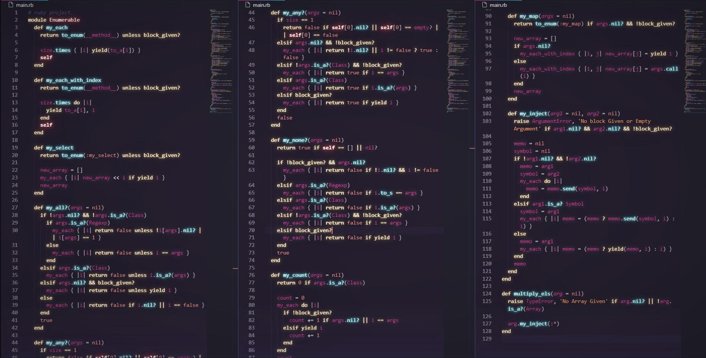

# Ruby Enumerables
The aim of this Ruby project is for us to rebuild some of the ruby  Enumerable methods

## Built With

- Ruby
- Rubocop

### Prerequisites

- Ruby must be Installed (Windows PC)
- Basic command line knowledge

### Setup

- Download or clone the repository
- Run a CLI and run `ruby main.rb` on your local machine
- Additionally, You can go to https://repl.it and select language ruby, copy paste the code, and run it.

## Author

👤 **Adan Fernandez Bonilla**

- Github: [@balerum03](https://github.com/balerum03)
- Twitter: @balerum03
- Linkedin: [linkedin](https://www.linkedin.com/in/adan-fernandez-bonilla-4560831a5)

👤 **Bereket Beshane**

- Github: [@berabjesus](https://github.com/Berabjesus)
- Twitter: [@bereket_ababu_b](https://twitter.com/bereket_ababu_b)
- Linkedin: [linkedin](https://www.linkedin.com/in/bereket-beshane-a1b75a1a9/)

## 🤝 Contributing

Contributions, issues and feature requests are welcome!

Feel free to check the [issues page](https://github.com/balerum03/custom-enumerables/issues).

## Show your support

Give a ⭐️ if you like this project!

## Acknowledgments

- Microverse
- GitHub
- TheOdinProject
- Ruby

## 📝 License

This project is [MIT](LICENSE) licensed.
